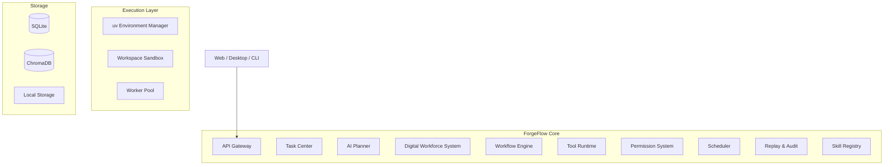

# ForgeFlow 产品需求文档（PRD）

**产品名称**：ForgeFlow
**产品版本**：V1.0
**文档类型**：正式 PRD（Product Requirements Document）
**产品定位**：面向 OPC（一人公司）与智能化组织的本地优先 AI 数字协作团队平台
**核心目标**：通过“数字化团队协作 + 自动化工作流执行 + 本地安全运行时”，帮助用户以自然语言驱动多个 AI 角色并行协作完成复杂任务，实现“一人即公司”的生产力模式。

---

# 一、产品概述

## 1.1 产品定义

ForgeFlow 是一个面向个人、开发者与企业用户的 AI 数字化协作团队平台。

系统通过自然语言理解用户目标，自动组建具备不同职责的数字化角色团队，并通过可持续执行的工作流系统完成任务拆解、角色协同、工具调用、任务调度、结果交付与持续运行。

ForgeFlow 的核心能力包括：

* AI 数字员工协作
* 自动化任务编排
* 本地安全执行
* 工具能力动态安装
* 长周期任务持续运行
* 工作流回放与审计
* 多端统一交互

系统采用 Local-First 架构设计，支持本地部署、内网部署与离线运行。

---

# 二、产品定位

# 2.1 产品定位

ForgeFlow 定位为：

# “数字化强协作团队平台（Digital AI Workforce Platform）”

系统通过 AI 角色化协作机制，构建可持续运行的数字化团队，使单个用户具备组织级任务执行能力。

用户角色为：

# “老板 / 指挥者”

系统角色为：

# “数字化团队”

用户仅需输入目标：

```text id="jlwm8g"
“帮我每天跟踪 AI 行业热点，并输出一份公众号内容草稿”
```

系统自动完成：

* 任务拆解
* 团队组建
* 工具调用
* 数据处理
* 内容生成
* 定时运行
* 异常恢复
* 最终交付

---

# 2.2 产品核心价值

ForgeFlow 的核心价值包括：

---

## 1. 数字化团队协作能力

系统通过多个 AI 角色并行协作，完成复杂任务。

包括：

* 信息收集
* 数据分析
* 内容生产
* 自动测试
* 任务复核
* 工作流执行

---

## 2. 连续任务执行能力

系统支持：

* 长时间运行
* 自动重试
* 状态恢复
* 定时调度
* 无人值守执行

避免传统 AI 工具频繁中断与人工确认。

---

## 3. 自动化工具能力扩展

系统支持：

* 自动搜索开源能力
* 自动安装工具
* 自动创建运行环境
* 自动封装为可复用 Skill

实现能力持续增长。

---

## 4. 本地优先与企业安全

系统默认：

* 数据本地存储
* 本地模型支持
* 本地执行
* 权限隔离
* 可审计运行

满足企业级隐私与安全要求。

---

# 三、目标用户

## 3.1 普通用户

### 用户特征

* 无编程能力
* 需要自动化生产力工具
* 希望通过 AI 替代重复劳动

### 核心需求

* 一句话完成任务
* 自动执行
* 无需配置环境
* 稳定持续运行

### 典型场景

* 内容生成
* 信息整理
* 数据监控
* 日程任务
* 自动报表

---

## 3.2 开发者用户

### 用户特征

* 具备技术背景
* 需要自动化运行时
* 希望复用 AI 工作流

### 核心需求

* Tool 扩展
* Workflow 自定义
* Skill 开发
* API 集成

### 典型场景

* 自动测试
* 数据抓取
* AI Coding Workflow
* 自动化运维

---

## 3.3 企业用户

### 用户特征

* 多成员协作
* 内网环境
* 数据安全要求高

### 核心需求

* 私有化部署
* 权限控制
* 审计日志
* 团队共享 Skill
* 长期稳定运行

### 典型场景

* 企业知识自动化
* 数据分析流水线
* 客服自动化
* AI 办公助手

---

# 四、产品核心理念

---

# 4.1 用户只描述目标

用户无需：

* 写代码
* 管理环境
* 配置工作流
* 调试依赖

系统负责：

* 理解需求
* 拆解任务
* 调度角色
* 组织执行
* 输出结果

---

# 4.2 AI 团队协作模式

系统中的 AI 角色采用明确职责分工机制。

不同角色：

* 拥有不同能力
* 使用不同工具
* 负责不同阶段任务

角色之间通过 Workflow Runtime 协同运行。

---

# 4.3 Workflow 持续执行机制

系统支持：

* 长周期任务
* 自动恢复
* 自动重试
* 状态持久化

避免传统 Agent 产品中断式执行问题。

---

# 五、系统总体架构



---

# 六、核心功能模块

# 6.1 数字化团队系统（核心）

## 模块定位

系统核心协作层。

负责：

* AI 角色创建
* 职责分工
* 并行任务执行
* 团队协作通信
* 结果汇总

---

## 系统角色类型

### 1. Planner（任务规划）

负责：

* 理解目标
* 拆解任务
* 生成 Workflow

---

### 2. Researcher（信息研究）

负责：

* 搜索资料
* 收集信息
* 分析数据

---

### 3. Operator（执行）

负责：

* 调用工具
* 执行 Workflow
* 操作 Runtime

---

### 4. Reviewer（审核）

负责：

* 结果校验
* 质量评分
* 错误检查

---

### 5. Reporter（交付）

负责：

* 汇总输出
* 格式化结果
* 生成交付物

---

## 协作机制

角色之间采用：

# Workflow Event Bus

进行通信。

支持：

* 并行执行
* 状态同步
* 任务转交
* 错误回退

---

# 6.2 Workflow Engine（核心）

## 模块定位

系统核心执行引擎。

负责：

* 工作流编排
* 节点执行
* 状态管理
* 异常恢复
* 长任务运行

---

## 支持能力

| 能力               | 描述     |
| ---------------- | ------ |
| Sequential       | 顺序执行   |
| Parallel         | 并行执行   |
| Conditional      | 条件分支   |
| Retry            | 自动重试   |
| Delay            | 延迟任务   |
| Event Trigger    | 事件触发   |
| Human Checkpoint | 人工审批节点 |
| Resume           | 中断恢复   |

---

## 核心特性

### 持久化状态

Workflow 状态自动保存。

系统崩溃后支持恢复执行。

---

### 长任务运行

支持：

* 小时级
* 天级
* 周期性

任务持续执行。

---

### 去确认化执行

系统支持：

* 自动权限策略
* 自动 Tool 调用
* 自动恢复

降低人工确认频率。

---

# 6.3 Tool Runtime（核心）

## 模块定位

系统底层能力执行层。

AI 不直接执行代码。

所有能力通过：

# Tool Runtime

统一调度。

---

## Tool 标准化结构

```json id="i2m8v6"
{
  "tool_name": "",
  "permissions": [],
  "inputs": {},
  "outputs": {},
  "timeout": 30
}
```

---

## Runtime 能力

### 权限控制

控制：

* 文件系统
* 网络
* Shell
* 数据访问

---

### 执行治理

包括：

* Timeout
* Retry
* Process Kill
* Memory Limit
* CPU Limit

---

### Tool Trace

记录：

* 调用时间
* 输入输出
* 错误信息
* Token 消耗

---

# 6.4 Skill Registry（核心）

## 模块定位

系统能力管理中心。

---

## Skill 定义

Skill 是：

# 可安装的自动化能力模块

---

## Skill 内容

```text id="0d5ktj"
skill/
 ├── manifest.yaml
 ├── workflow.json
 ├── permissions.json
 ├── adapters/
 ├── tests/
 ├── requirements.lock
 └── metadata.json
```

---

## Skill 能力

| 功能      | 描述   |
| ------- | ---- |
| Install | 安装   |
| Update  | 更新   |
| Test    | 自动测试 |
| Replay  | 回放   |
| Share   | 团队共享 |
| Audit   | 安全审计 |

---

# 6.5 Scheduler（调度系统）

## 模块定位

系统持续运行核心。

---

## 支持能力

| 类型                  | 描述   |
| ------------------- | ---- |
| Cron                | 周期任务 |
| Event Trigger       | 事件触发 |
| Retry Schedule      | 自动重试 |
| Conditional Trigger | 条件触发 |
| Queue Execution     | 队列调度 |

---

## 核心特性

### 持久化任务

任务信息永久保存。

---

### 自动恢复

系统重启后自动恢复任务。

---

### 分布式 Worker

支持多 Worker 并发执行。

---

# 6.6 Replay & Audit（核心）

## 模块定位

系统可维护性核心。

---

## 功能能力

### Workflow Replay

支持任务重放。

---

### Tool Trace

查看完整 Tool 调用链。

---

### Error Debug

查看错误原因。

---

### Audit Log

生成完整审计记录。

---

# 七、安全架构

# 7.1 Local-First 安全模型

系统默认：

* 数据本地
* 模型本地
* 执行本地

---

# 7.2 Workspace Sandbox

所有任务仅允许访问：

```text id="kg4p3x"
.forgeflow/workspace/
```

---

# 7.3 Capability Permission System

AI 无系统级权限。

AI 只能申请：

* 文件权限
* 网络权限
* Tool 权限

由 Runtime 审核执行。

---

# 7.4 网络白名单

Skill 必须声明：

```json id="1ljz5j"
{
  "allowed_domains": []
}
```

---

# 八、技术架构与开源组件选型

# 8.1 前端层

| 模块          | 技术         |
| ----------- | ---------- |
| Web         | Next.js    |
| UI          | shadcn/ui  |
| Workflow UI | React Flow |
| Desktop     | Tauri      |
| 状态管理        | Zustand    |

---

# 8.2 后端层

| 模块       | 技术          |
| -------- | ----------- |
| API      | FastAPI     |
| Workflow | LangGraph   |
| Runtime  | Python      |
| 调度       | APScheduler |
| 权限系统     | Casbin      |
| Schema   | Pydantic    |

---

# 8.3 AI 层

| 模块          | 技术         |
| ----------- | ---------- |
| LLM Gateway | LiteLLM    |
| 本地模型        | Ollama     |
| RAG         | LlamaIndex |
| Embedding   | BGE-small  |

---

# 8.4 环境管理层

| 模块             | 技术         |
| -------------- | ---------- |
| Python Runtime | uv         |
| 隔离环境           | uv venv    |
| Process 管理     | subprocess |

---

# 8.5 数据层

| 模块          | 技术        |
| ----------- | --------- |
| Metadata    | SQLite    |
| Vector DB   | ChromaDB  |
| Local Cache | DiskCache |

---

# 九、部署模式

# 9.1 Desktop Edition

面向普通用户。

Tauri 打包：

* 本地 Runtime
* 内置 Python
* 本地模型支持

---

# 9.2 Developer Edition

面向开发者。

支持：

* CLI
* SDK
* Tool 开发

---

# 9.3 Enterprise Edition

面向企业。

支持：

* 内网部署
* 多用户协作
* 审计系统
* 私有模型
* Worker 集群

---

# 十、MVP 范围

# V1.0 功能范围

---

## 必须实现

### 1. 自然语言任务创建

---

### 2. 数字化团队协作执行

---

### 3. Workflow Runtime

---

### 4. Tool Runtime

---

### 5. Scheduler

---

### 6. Replay & Audit

---

### 7. Skill 安装系统

---

# 不包含功能

| 功能         | 状态   |
| ---------- | ---- |
| 多组织协作      | 后续版本 |
| 分布式 GPU 调度 | 后续版本 |
| AI 自主长期规划  | 后续版本 |
| 自主大型项目开发   | 后续版本 |

---

# 十一、商业化方向

# 11.1 免费版

支持：

* 本地运行
* 基础 Workflow
* 本地模型接入

---

# 11.2 专业版

支持：

* 高级 Workflow
* 企业权限
* 审计系统
* Skill Marketplace

---

# 11.3 企业版

支持：

* 私有化部署
* 多团队协作
* Worker 集群
* 企业安全策略

---

# 十二、产品愿景

ForgeFlow 的长期目标是：

# 构建 AI 时代的数字化协作组织操作系统。

用户通过自然语言驱动数字化团队，实现：

* 自动化生产
* 长周期运行
* 多角色协作
* 可持续交付

最终形成：

# “一个人即一家公司的智能化生产模式”。
